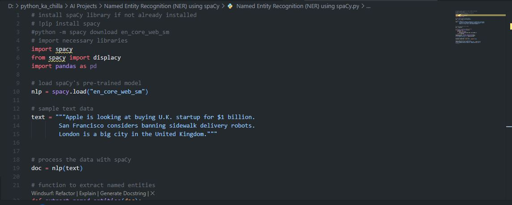
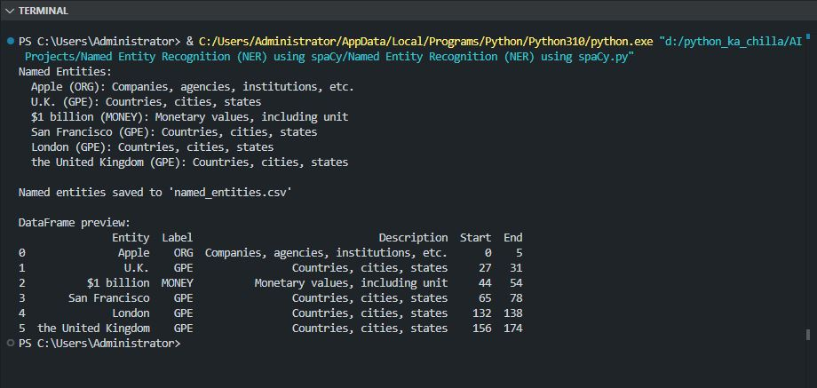

# 🏷️ Named Entity Recognition (NER) using spaCy 🔍  
    

<p align="center">
  
</p>

🚀 This project demonstrates **Named Entity Recognition (NER)** using spaCy, a popular NLP library. It processes a sample text, identifies entities such as organizations, locations, monetary values, and more, and exports the results to a CSV file. Ideal for learning about information extraction and entity recognition.

---

## ✨ Key Features  
🔍 **Entity Extraction** – Recognizes entities like ORG, GPE, MONEY, etc.  
📚 **spaCy Integration** – Uses the pre‑trained `en_core_web_sm` model  
📊 **Structured Output** – Saves entities to a pandas DataFrame and CSV  
📝 **Sample Text Included** – Ready‑to‑run example with diverse entities  
🧠 **Educational Code** – Clear, well‑commented script for learning  

---

## 🧠 Tech Stack  
- **Language:** Python 🐍  
- **Library:** spaCy (NLP)  
- **Data Handling:** pandas  
- **Model:** `en_core_web_sm` (English small pipeline)  

---

## 📦 Installation  

```bash
git clone https://github.com/SayabArshad/Named-Entity-Recognition-spaCy.git
cd Named-Entity-Recognition-spaCy
pip install spacy pandas
python -m spacy download en_core_web_sm
```
---

## ▶️ Usage

Run the main script:

```bash
python "Named Entity Recognition (NER) using spaCy.py"
```

The script will:

Load the spaCy model.

Process the sample text.

Print each detected entity with its label and description.

Save the entities to named_entities.csv and display a preview.

---

## 📁 Project Structure

```
Named-Entity-Recognition-spaCy/
│-- Named Entity Recognition (NER) using spaCy.py   
│-- named_entities.csv                                
│-- README.md                                          
│-- assets/                                            
│    ├── code.JPG
│    └── output.JPG
```
---

## 🖼️ Interface Previews

| 📝 Code Snippet | 📊 Console Output |
|:---------------:|:-----------------:|
|  |  |

---

## 💡 About the Project

Named Entity Recognition is a fundamental NLP task that identifies and classifies named entities in text (e.g., person names, organizations, locations, dates, etc.). This project uses spaCy, an industrial‑strength NLP library, to perform NER on a short paragraph. The detected entities are displayed in the console and also saved to a CSV file for further analysis. The example text includes an organization (Apple), a country (U.K.), a monetary value ($1 billion), and several locations (San Francisco, London). This script provides a solid foundation for building more advanced information extraction pipelines.

---

## 🧑‍💻 Author

**Developed by:** [Sayab Arshad Soduzai](https://github.com/SayabArshad) 👨‍💻

📅 **Version:** 1.0.0

📜 **License:** MIT License

---

## ⭐ Contributions

Contributions are welcome! Fork the repository, open issues, or submit pull requests to enhance functionality (e.g., processing custom files, adding visualizations, or integrating with other NLP tools).
If you find this project helpful, please ⭐ star the repository to show your support.

---

## 📧 Contact

For queries, collaborations, or feedback, reach out at **[sayabarshad789@gmail.com](mailto:sayabarshad789@gmail.com)**

---

🏷️ Unlocking insights from text, one entity at a time.

---
